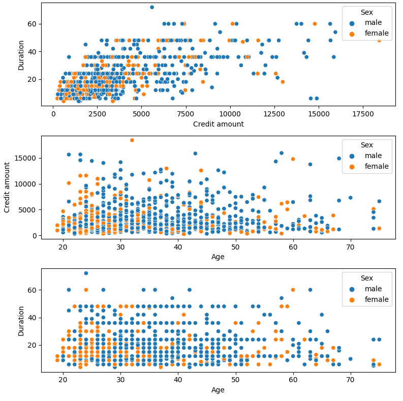
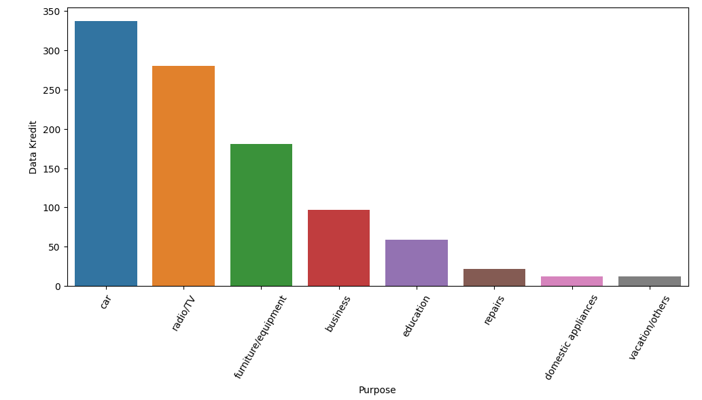
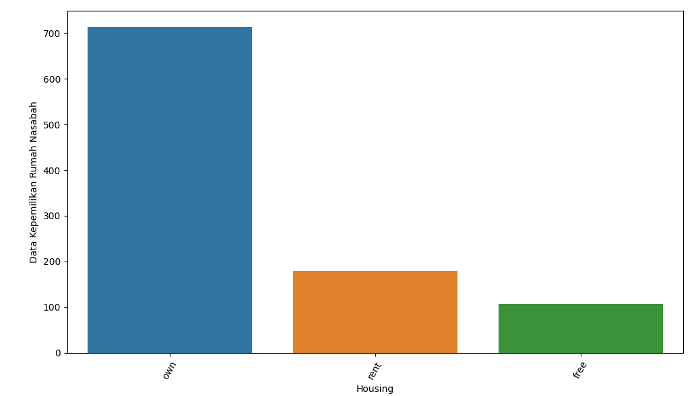
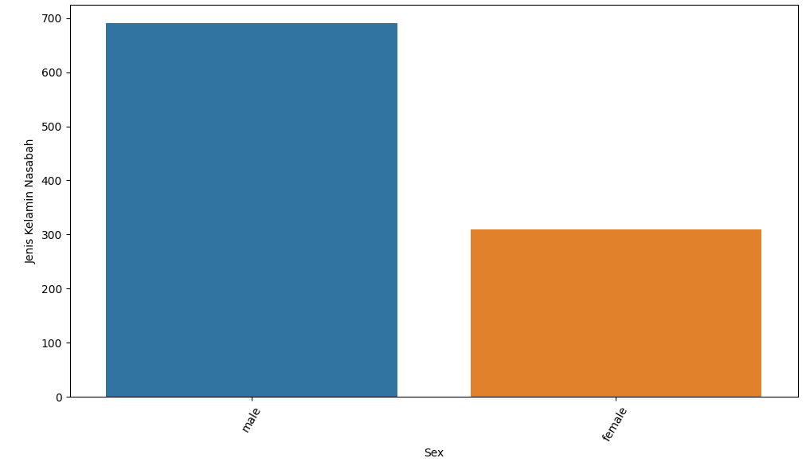
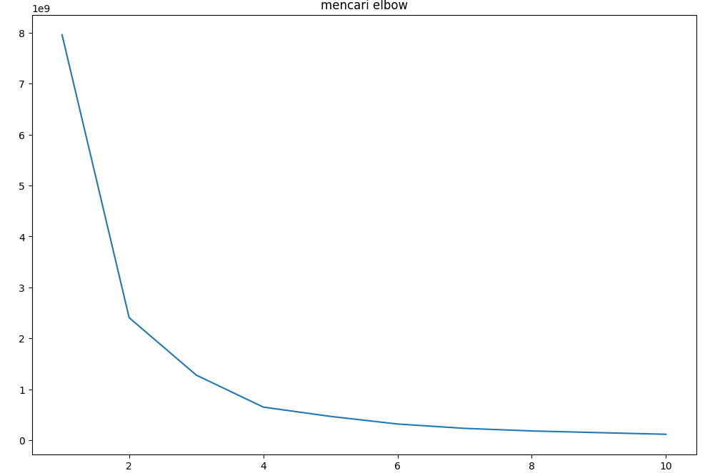
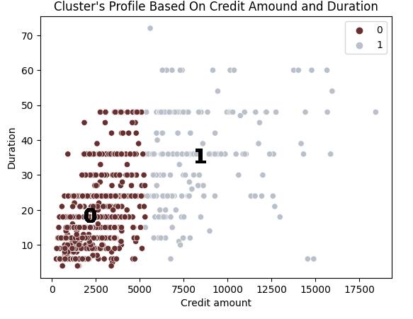
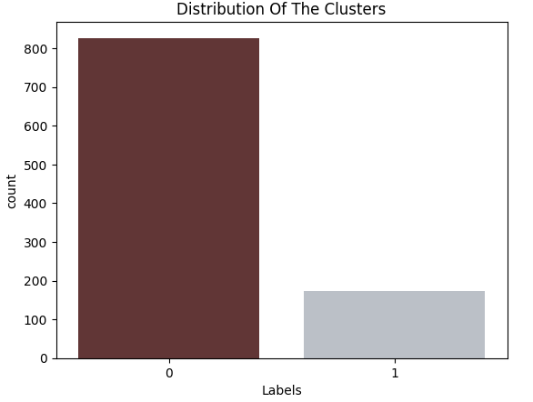

# Laporan Proyek Machine Learning

### Nama : Mega Dwi Rengganis

### Nim : 211351081

### Kelas : TIF Pagi A

## Domain Proyek


Pada suatu perusahaan yang bergerak pada jasa peminjaman uang atau umum disebut kredit, tentunya harus melakukan analisa terhadap data para nasabah perusahaan tersebut. Hal yang umum dilakukan ketika melakukan analisa nasabah adalah dengan meng-segmentasi para nasabah sesuai dengan kriteria yang mereka miliki. Segmentasi ini diperlukan guna mengetahui nasabah mana yang berpotensi dan nasabah mana yang riskan. Dengan mengsegmentasi tersebut pula, perusahaan dapat memberikan treatment yang sesuai kepada para nasabahnya.

## Business Understanding

### Problem Statements

- Perusahaan perlu memberikan treatment yang sesuai dan ter-personalisasi kepada para nasabah guna menjaga nasabah.

### Goals

- Perusahaan dapat mengsegmentasi data para nasabah.

### Solution statements

- Membangun suatu sistem yang dapat mempelajari data para nasabah untuk dilakukan segmentasi data nasabah.
- Sistem berjalan dengan menggunakan metode K Means yang dinilai cocok untuk melakukan segmentasi atau clustering.

## Data Understanding

Dataset yang digunakan berasal dari situs Kaggle. Dataset ini mengandung 1000 entries dan 9 columns<br>

Link Dataset: [German Credit Risk](https://www.kaggle.com/datasets/uciml/german-credit/).

### Variabel-variabel yang terdapat pada Dataset adalah sebagai berikut:

- Age (numeric) = umur nasabah
- Sex = jenis kelamin nasabah
- Job (numeric: 0 - unskilled and non-resident, 1 - unskilled and resident, 2 - skilled, 3 - highly skilled) = pekerjaan nasabah
- Housing (text: own, rent, or free)
- Saving accounts (text - little, moderate, quite rich, rich)
- Checking account (numeric, in DM - Deutsch Mark)
- Credit amount (numeric, in DM)
- Duration (numeric, in month)
- Purpose (text: car, furniture/equipment, radio/TV, domestic appliances, repairs, education, business, vacation/others)

## Exploratory Data Analyst (EDA)

### Perbandingan Laki-laki dan Perempuan dalam Data


Pada grafik diatas kita melihat bahwa Laki-laki lebih banyak memiliki kredit yang besar dibandingkan perempuan. Laki-laki pula meminjam dengan umur yang lebih tua daripada perempuan.

### Data Alasan Peminjaman


Dari data diatas kita melihat bahwa alasan kredit terbanyak adalah kendaraan khususnya mobil, disusul dengan alasan barang elektronik khususnya radio dan TV.

### Data Nasabah


Dari data diatas kita melihat bahwa nasabah mayoritas memiliki jenis kelamin laki-laki.

### Data Rumah Nasabah


Dari data diatas kita melihat bahwa nasabah mayoritas memiliki rumah daripada masih mengontrak/menyewa hunian dan tidak memiliki rumah.

## Data Preparation

Pertama-tama import semua library yang dibutuhkan,

```bash
import pandas as pd
import matplotlib.pyplot as plt
import seaborn as sns
from sklearn.cluster import KMeans
```

Setelah itu kita akan men-definsikan dataset menggunakan fungsi pada library pandas

```bash
df = pd.read_csv('/content/german_credit_data.csv')
```

Lalu kita akan melihat informasi mengenai dataset dengan syntax seperti dibawah:

```bash
df.info()
```

Dengan hasil sebagai berikut:

```bash
<class 'pandas.core.frame.DataFrame'>
RangeIndex: 1000 entries, 0 to 999
Data columns (total 10 columns):
 #   Column            Non-Null Count  Dtype
---  ------            --------------  -----
 0   Unnamed: 0        1000 non-null   int64
 1   Age               1000 non-null   int64
 2   Sex               1000 non-null   object
 3   Job               1000 non-null   int64
 4   Housing           1000 non-null   object
 5   Saving accounts   817 non-null    object
 6   Checking account  606 non-null    object
 7   Credit amount     1000 non-null   int64
 8   Duration          1000 non-null   int64
 9   Purpose           1000 non-null   object
dtypes: int64(5), object(5)
memory usage: 78.2+ KB
```

<br>

Selanjutnya memeriksa apakah ada data yang berisi nilai null pada dataset:

```bash
df.isna().sum()
```

Dengan hasil sebagai berikut:

```bash
Unnamed: 0            0
Age                   0
Sex                   0
Job                   0
Housing               0
Saving accounts     183
Checking account    394
Credit amount         0
Duration              0
Purpose               0
dtype: int64
```

 <br>

### Mengisi Nilai Null

```bash
df["Saving accounts"].fillna(method="bfill",inplace=True)
df["Checking account"].fillna(method="bfill",inplace=True)
```

kita akan mengisi nilai null pada dataset agar dataset seluruhnya memiliki value yang sesuai. Dan berikut adalah hasilnya:

```bash
Unnamed: 0          0
Age                 0
Sex                 0
Job                 0
Housing             0
Saving accounts     0
Checking account    0
Credit amount       0
Duration            0
Purpose             0
dtype: int64
```

#### Merubah kolom housing menjadi numerik

Kita akan memeriksa value apa saja yang bukan numerik yang ada di kolom cut

```bash
y = [x for x in df['Housing'] if x.isnumeric() == False]
print(y)
```

> ['own', 'own', 'own', 'free', 'free', 'free', 'own', 'rent', 'own', 'own', 'rent', 'rent', 'own', 'own', 'rent', 'own', 'own', 'own', 'free', 'own,...]

value tersebut lalu kita ubah menjadi numerik dan tipe data kolom tersebut menjadi numerik

```bash
df['Housing'] = df['Housing'].str.replace('free','0')
df['Housing'] = df['Housing'].str.replace('own','1')
df['Housing'] = df['Housing'].str.replace('rent','2')
df['Housing'] = pd.to_numeric(df['Housing'])
```

#### Merubah kolom Saving Accounts menjadi numerik

Kita akan merubah value dan kolom Saving Accounts menjadi numerik agar dapat diolah

```bash
df['Saving accounts'] = df['Saving accounts'].str.replace('little','0')
df['Saving accounts'] = df['Saving accounts'].str.replace('moderate','1')
df['Saving accounts'] = df['Saving accounts'].str.replace('quite rich','2')
df['Saving accounts'] = df['Saving accounts'].str.replace('rich','3')
df['Saving accounts'] = pd.to_numeric(df['Saving accounts'])
```

#### Merubah kolom Checking Accounts menjadi numerik

Kita akan merubah value dan kolom Checking Accounts menjadi numerik agar dapat diolah

```bash
df['Checking account'] = df['Checking account'].str.replace('little','0')
df['Checking account'] = df['Checking account'].str.replace('moderate','1')
df['Checking account'] = df['Checking account'].str.replace('quite rich','2')
df['Checking account'] = df['Checking account'].str.replace('rich','3')
df['Checking account'] = pd.to_numeric(df['Checking account'])
```

#### Merubah kolom Purpose menjadi numerik

Kita akan merubah value dan kolom Purpose menjadi numerik agar dapat diolah

```bash
df['Purpose'] = df['Purpose'].str.replace('radio/TV','0')
df['Purpose'] = df['Purpose'].str.replace('education','1')
df['Purpose'] = df['Purpose'].str.replace('furniture/equipment','2')
df['Purpose'] = df['Purpose'].str.replace('car','3')
df['Purpose'] = df['Purpose'].str.replace('business','4')
df['Purpose'] = df['Purpose'].str.replace('domestic appliances','5')
df['Purpose'] = df['Purpose'].str.replace('repairs','6')
df['Purpose'] = df['Purpose'].str.replace('vacation/others','7')
df['Purpose'] = pd.to_numeric(df['Purpose'])
```

#### Merubah kolom Purpose menjadi numerik

Kita akan merubah value dan kolom Purpose menjadi numerik agar dapat diolah

```bash
  df['Sex'] = df['Sex'].str.replace('male','1')
  df['Sex'] = df['Sex'].str.replace('female','0')
  df['Sex'] = df['Sex'].str.replace('fe1','2')
  df['Sex'] = pd.to_numeric(df['Sex'])
```

### Membuat feature

Setelah seluruh kolom bertipe data integer, maka kita dapat membuat fitur dari kolom-kolom tersebut.
Feature digunakan sebagai parameter menghitung hasil clustering yang diharapkan. Untuk membuat feature dan target dengan codingan sbgai berikut:

```bash
x = df.drop(['Sex'], axis=1)
```

Kita akan membuang kolom Sex dan sisa kolom yang lain akan digunakan sebagai feature

## Modeling

Pada tahap modeling, kita akan menggunakan metode KMeans Clustering, untuk membuat metode clustering yang baik, maka kita harus mencari tahu elbow point yang sesuai agar hasil clustering kita pun baik.

```bash
clusters=[]
for i in range(1,11):
  kmeans = KMeans(n_clusters=i).fit(x)
  clusters.append(kmeans.inertia_)

fig,ax=plt.subplots(figsize=(12,8))
sns.lineplot(x=list(range(1,11)), y=clusters, ax=ax)
ax.set_title('mencari elbow')
ax.set_xlabel('clusters')
ax.set_xlabel('inertia')
```



dari hasil diatas kita lihat bahwa elbow point tepat berada di titik/inertia 2 dan 3. Sehingga jumlah cluster kita bisa diantara 2 dan 3.

Selanjutnya kita akan membuat dan menerapkan algoritma KMeans pada data x yang telah kita siapkan sebelumnya. Kita akan mencoba membuat cluster dengan jumlah cluster sebanyak 2.

```bash
n_clust = 2
kmean = KMeans(n_clusters=n_clust).fit(x)
x['Labels'] = kmean.labels_
```

### Visualisasi Model

Sebagai contoh, kita akan melihat salah satu contoh hasil dari model clustering kita, hasil clustering pun akan membuat kolom baru dalam data x, yaitu kolom label yang memuat label/hasi cluster dari masing-masing data. Kita akan melihat hasil clustering pada kolom credit amount dan duration

Secara sederhana, kita mendapatkan 2 segmentasi nasabah yaitu nasabah dengan credit 0-5000 dengan durasi kredit berkisar dari 10-50 minggu. Lalu ada nasabah dengan kredit berkisar dari 5000-17500 dengan durasi kredit yang lebih bervariatif dan lebih panjang.

Selanjutnya kita akan melihat data jumlah dari kolom label pada data kita:

Ternyata nasabah yang masuk kedalam label/cluster 1 memiliki data paling banyak.

## Evaluation

Salam meng-evaluasi model clustering kita, kita akan menggunakan sebuah metode yang bernama Silhouette Score. Metode ini sebenernya mirip seperti mencari elbow point yanng bertujuan untuk melihat berapakah jumlah cluster yang baik untuk data kita. Kita akan melihat apakah jumlah cluster yang kita gunakan yaitu 2 sudah baik atau ternyata ada jumlah cluster yang lebih baik untuk data kita.

```bash
from sklearn.metrics import silhouette_score
import warnings
warnings.filterwarnings("ignore")

# Silhouette analysis
range_n_clusters = [2, 3, 4, 5, 6, 7, 8]

for num_clusters in range_n_clusters:

    # intialise kmeans
    kmeans = KMeans(n_clusters=num_clusters, max_iter=50)
    kmeans.fit(x_test)

    cluster_labels = kmeans.labels_

    # silhouette score
    silhouette_avg = silhouette_score(x_test, cluster_labels)
    print("For n_clusters={0}, the silhouette score is {1}".format(num_clusters, silhouette_avg))
```

Dari kode diatas kita dapat melihat hasil sebagai berikut:

```bash
For n_clusters=2, the silhouette score is 0.722242491850519
For n_clusters=3, the silhouette score is 0.6475773761132896
For n_clusters=4, the silhouette score is 0.6116661500899592
For n_clusters=5, the silhouette score is 0.5820563826464814
For n_clusters=6, the silhouette score is 0.5776363126783991
For n_clusters=7, the silhouette score is 0.5777320739775139
For n_clusters=8, the silhouette score is 0.5724130408752136
```

Ternyata jumlah cluster sebanyak 2 memiliki skor paling besar diantara yang lain, yang mengartikan bahwa model kita sudah berjalan dengan baik dengan jumlah cluster sebanyak 2.

## Deployment

Link Streamlit: https://app-grmn-credit-efh229aaj7k6xvhgy7kyzr.streamlit.app/
